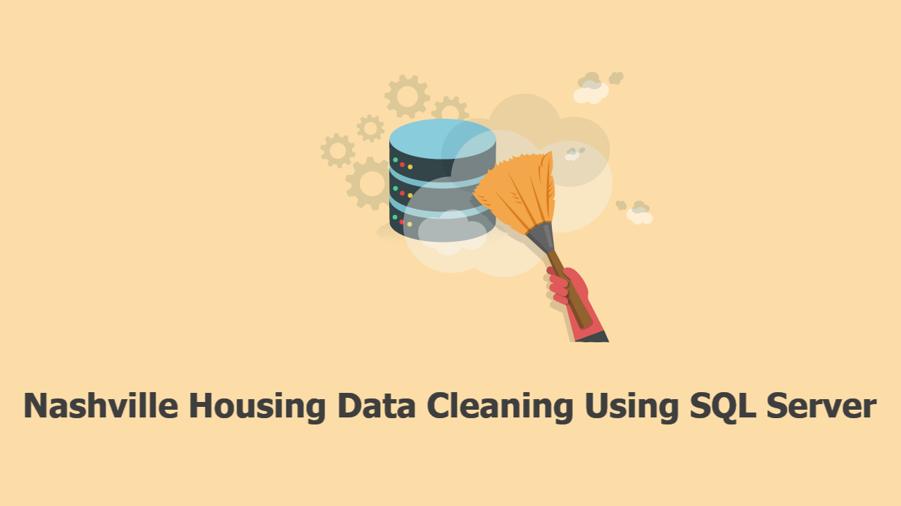

<!-- PROJECT TITLE -->
<h1 align="center">Nashville Housing Data Cleaning Using SQL Server</h1>

<!-- HEADER -->

  

<!-- PROJECT OVERVIEW -->
##  **➲ Project overview**
This project focuses on cleaning and organizing the Nashville Housing dataset using SQL Server. The dataset is loaded into a SQL Server database named "Nashville," and the main table is called "NashvilleHousing." Various cleaning operations are performed on the dataset to ensure consistency and accuracy of the information.

<!-- PREREQUISTIES -->
##  **➲ Prerequisites**
This is list of required tools for the project to be installed :
* <a href="https://www.microsoft.com/en-us/sql-server/sql-server-downloads" target="_blank">SQL Server</a>
* <a href="https://learn.microsoft.com/en-us/sql/ssms/download-sql-server-management-studio-ssms?view=sql-server-ver16" target="_blank">SQL Server Management Studio (SSMS)</a>

<!-- THE DATASET -->
##  **➲ The Dataset**
Download the <a href="https://github.com/AlexTheAnalyst/PortfolioProjects/blob/main/Nashville%20Housing%20Data%20for%20Data%20Cleaning%20(reuploaded).xlsx" target="_blank">Nashville Housing</a> data from GitHub. 

<!-- THE DATABASE -->
##  **➲ The Database**
1. Download the Dataset
    * Download the Nashville Housing data from the provided link.
2. Database Creation:
    * Use SQL Server to create a database named Nashville.
3. Table Creation:
    * Import the respective datasets into their corresponding table.

<!-- DATA CLEANING -->
##  **➲ SQL Queries and Cleaning**
In this part we created multiple queries for cleaning the table from the database and all queries can be founded in Queries folder in Data_Cleaning.sql:
 

* Standardize Date Format
Change the datatype of the "SaleDate" column from datetime to date to standardize the date format.

* Populate Property Address Data
Populate the "PropertyAddress" column with a value if the corresponding "ParcelID" has a null value for the "PropertyAddress."

* Breaking Out Address into Individual Columns
Separate the "Address" column into individual columns for "Address," "City," and "State."

* Update the "SoldAsVacant" column to replace 'Y' with 'Yes' and 'N' with 'No.'

* Remove Duplicates

* Delete Unused Columns
Remove unnecessary columns such as "OwnerAddress," "TaxDistrict," "PropertyAddress," and "SaleDate."

<!-- CONCLUSION -->
##  **➲ Conclusion**
The Nashville Housing dataset has been successfully cleaned and organized using SQL Server. The provided SQL queries demonstrate the steps taken to standardize date formats, populate missing values, break down address information, replace values in specific columns, remove duplicates, and delete unused columns. This ensures that the dataset is consistent and ready for further analysis or integration into other applications.

<!-- CONTACT -->
##  **➲ Contact**
- E-mail   : [omaarelsherif@gmail.com](mailto:omaarelsherif@gmail.com)
- LinkedIn : https://www.linkedin.com/in/omaarelsherif/
- Facebook : https://www.facebook.com/omaarelshereif
